# Cross-Site Scripting (XSS) 

Second laboratory of the Cybersecurity Laboratory course. 

In this report, the OWASP Juice Shop webapp is used to showcase the exploitation of two XSS vulnerabilities.

Respectively:
- [DOM-based XSS](#1-dom-based-xss) 
- [Reflected XSS](#2-reflected-xss)

### Tools
- OWASP Juice Shop (running from Docker image) v19.0.0

## 1. DOM-based XSS 

We want to execute a client-side Cross-Site Scripting attack where the malicious payload is executed entirely within the browser's DOM environment.

### Payload:

- ```html
    <iframe src="javascript:alert(`xss`)">
    ```

We look for a ***valid injection point*** that the client-side code transmits to an execution function. 
Additionally, we need the input to be processed without sanitization or encoding.

The most obvious way is through the search bar. 
We note that when a search is performed (e.g., <span style="color: #1872a2; font-weight: bold;">orange</span>), the generated URL becomes: 

- **Normal Search**:  `http://localhost:3000/#/search?q=`<span style="color: #1872a2; font-weight: bold;">orange</span>

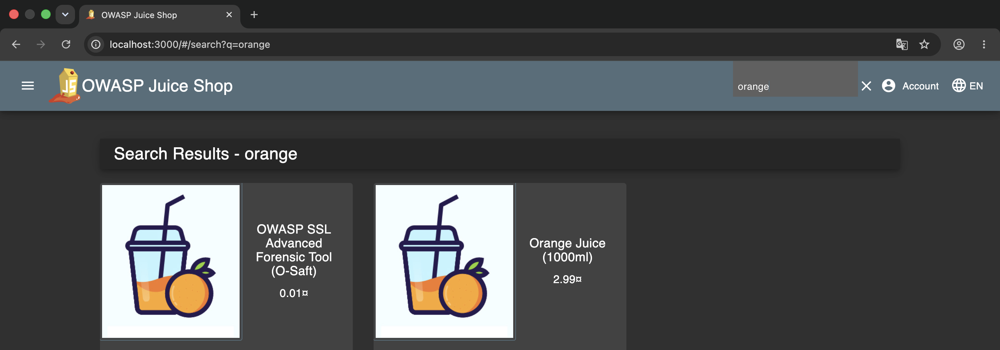

This allows us to insert our payload directly into the URL immediately after the 'q' parameter.

- **Altered Search**:
`http://localhost:3000/#/search?q=`<span style="color: #1872a2; font-weight: bold;">%3Ciframe%20src%3D%22javascript:alert(%60xss%60)%22%3E</span> 

The attempt was successful because the search input is neither sanitized nor encoded and is inserted directly into the DOM.

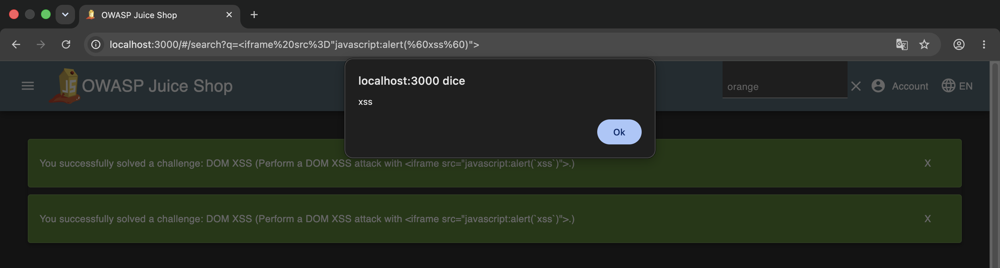
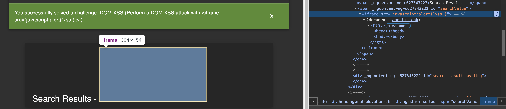

We can then analyze the source through the browser's Developer Tools to understand how the input is processed.

We note that with a normal search the id is 'searchValue'.

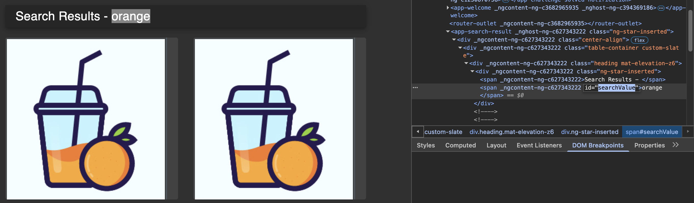

The input is handled by the ***<span style="color: #1872a2; font-weight: bold;">filterTable()</span>*** function.

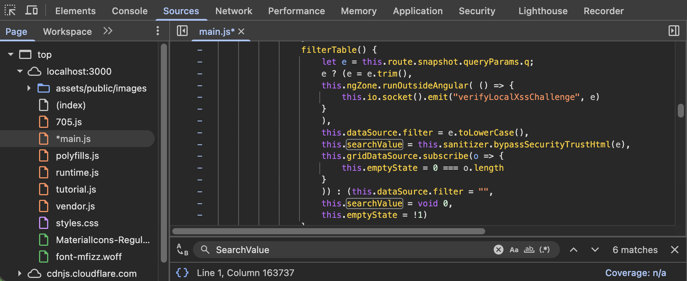

Here we find the suspicious line of code:

```javascript
     this.searchValue = this.sanitizer.bypassSecurityTrustHtml(e)
```

The web app uses Angular `domSanitizer` to sanitize the input, which would prevent us from executing malicious code.
However, we note that `bypassSecurityTrustHtml` (a built-in Angular method) is used to convert the input into trusted HTML, effectively bypassing the sanitization. 


## 2. Reflected XSS

In this case we see an XSS attack where the payload is part of an http request sent to the server where, due to lack of sanitization, it is reflected in the backend JSON response.

### Preliminary steps
1. Create an account, e.g.: 
    - a@gmail.com
2. Login
3. Add a product to the basket and buy it
4. Go to Account >> Orders & Payment >> Order History >> Track Order 

We can see that the result code appears in the URL and in the page at the same time, so we can inject the command in the URL over the track order number:

- **Track Order Number**: `http://localhost:3000/#/track-result?id=`<span style="color: #1872a2; font-weight: bold;">70b0-1bf44bcc83d37dfd</span>

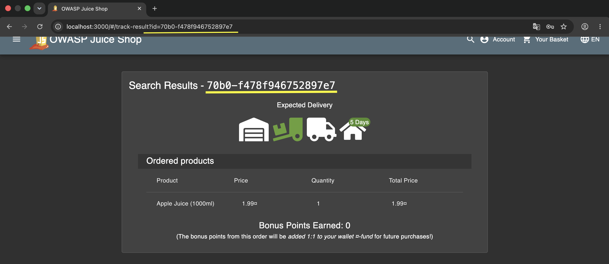

- **Injection**: `http://localhost:3000/#/track-result?id=`<span style="color: #1872a2; font-weight: bold;">%3Ciframe%20src%3D%22javascript:alert(%60xss%60)%22%3E</span>

After pasting the payload, reload the page to trigger the vulnerability.

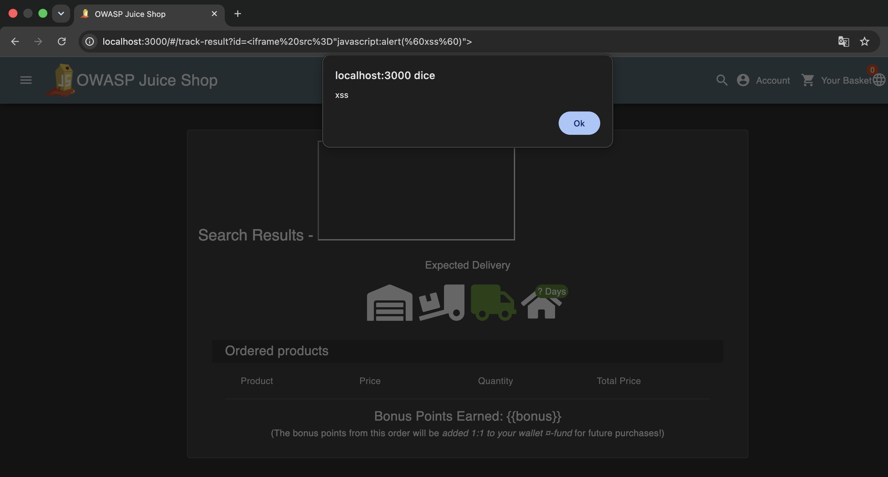

Looking with the developer tools, we notice that the input is inserted into the page.

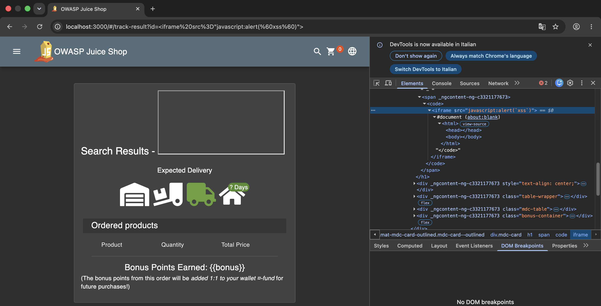

We note that the tag associated with the protocol number is a `<code>`. 
This allows us to search through the source files to understand how the input is processed.

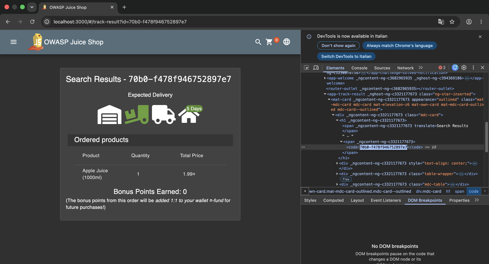

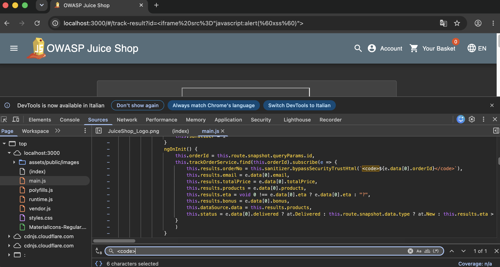

We note that the function that handles the tracking result does not perform sanitization or encoding of the input.
The function that manages the logic is ***<span style="color: #1872a2; font-weight: bold;">ngOnInit()</span>***

Specifically, the code involved is: 

```javascript
     this.results.orderNo = this.sanitizer.bypassSecurityTrustHtml(`<code>${e.data[0].orderId}</code>`)
```

Again, the vulnerability is linked to the use of `bypassSecurityTrustHtml` which allows bypassing input sanitization.

We can also observe the traffic generated when we submit the request in the browser.

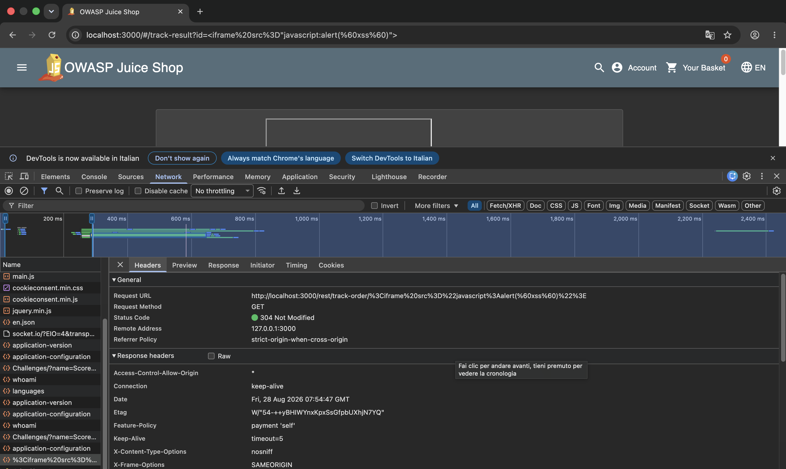
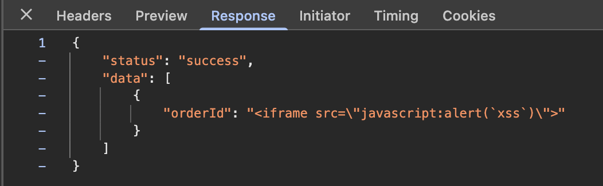

Completing this challenge marks both XSS objectives as solved.

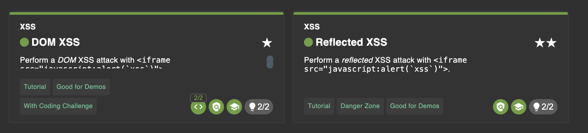

## Vulnerability Comparison & discussion 

DOM-based XSS: The user input is read, processed, and executed entirely on the client side by browser-executed scripts. The backend server does not need to store or process the malicious payload in its response for the payload to execute.

Reflected XSS: The payload travels to the backend server within an HTTP request. The server includes this unvalidated input in its response (a JSON payload). When the client application renders this reflected data without sanitization, the injected script executes within the victim's session context.