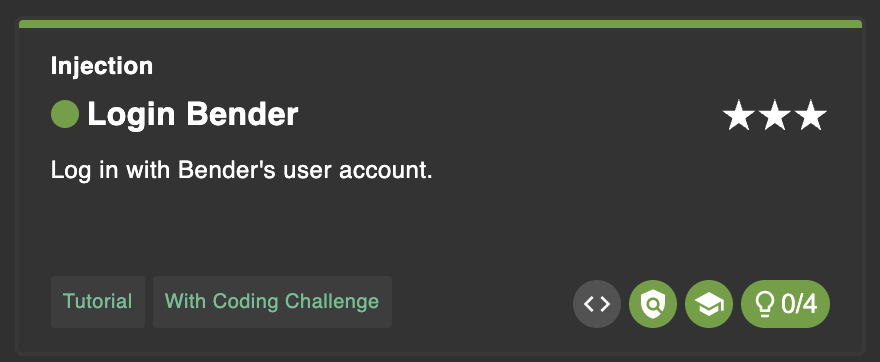
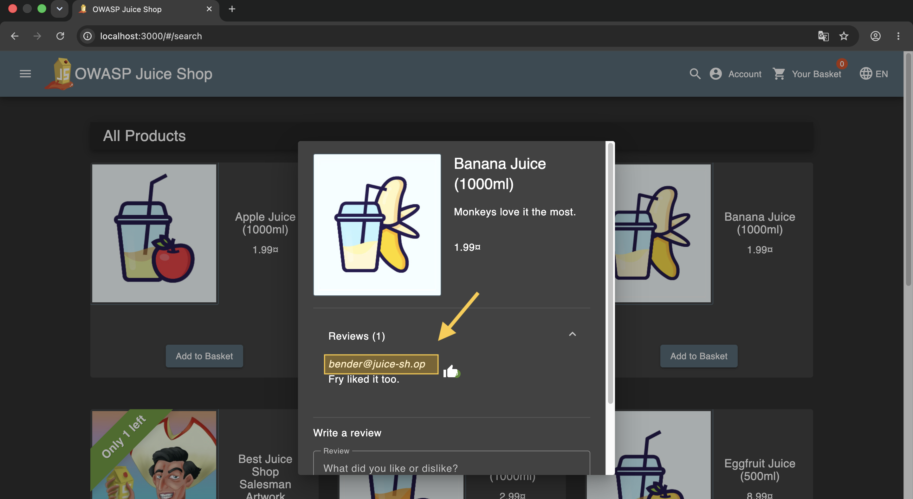
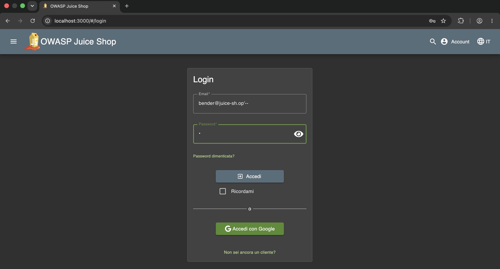
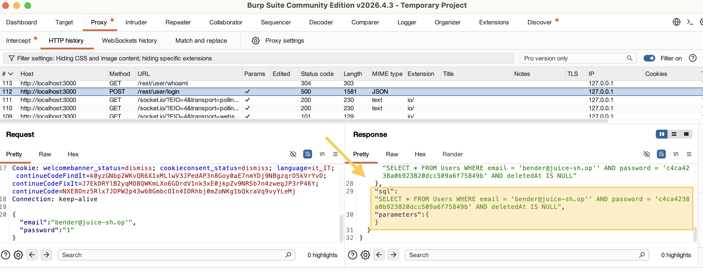
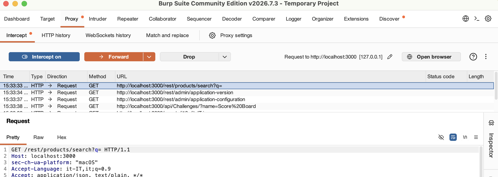
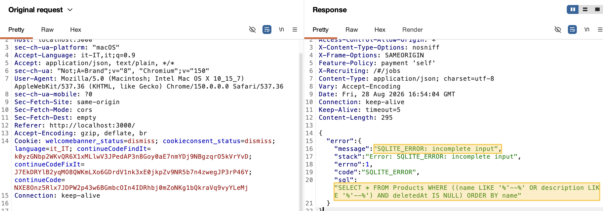
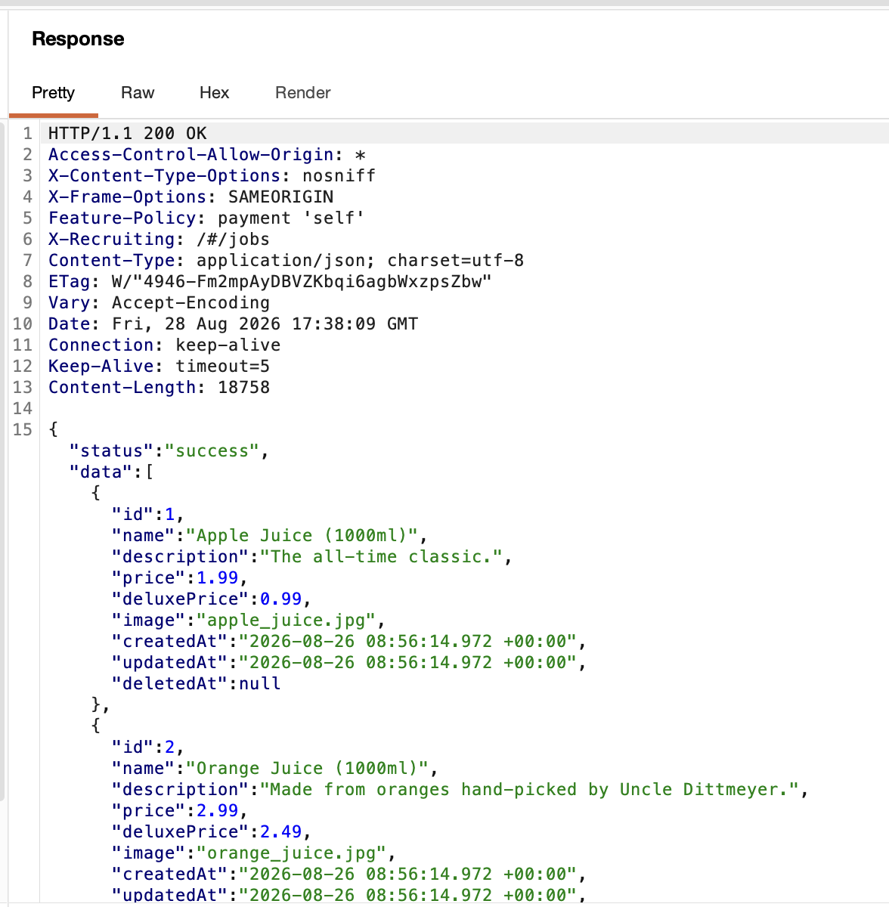
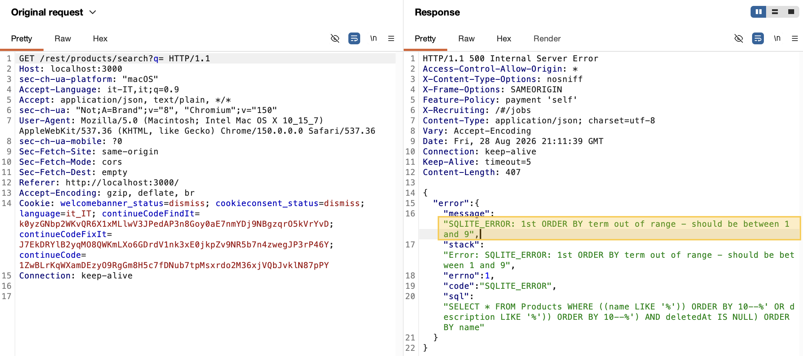
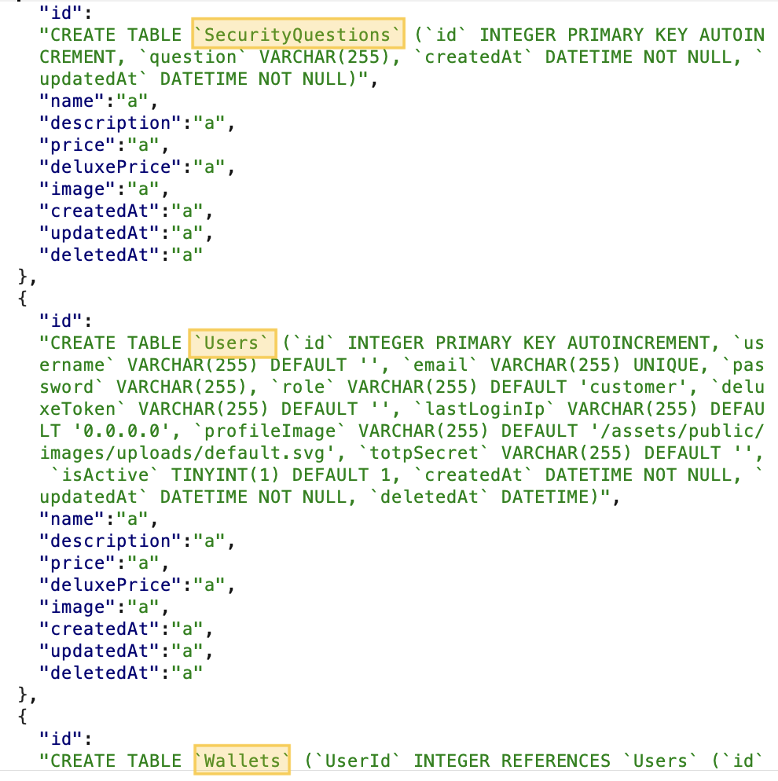
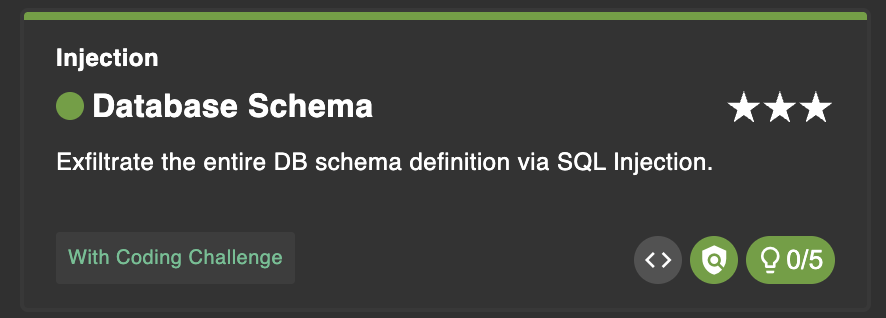

# SQL Injection (SQLI)

Third laboratory of the Cybersecurity Laboratory course. 

In this report, the OWASP Juice Shop webapp is used to showcase the exploitation of two SQL Injection vulnerabilities.
In particular: 

- [Bypassing Authentication](#1-bypassing-authentication)
- [Extracting data](#2-extracting-data) 

### Tools

- OWASP Juice Shop (running from Docker image) v19.0.0
- Burp Suite Community Edition v2026.7.3

## 1. Bypassing Authentication

The objective is to identify a vulnerable entry point where SQL Injection can be performed to authenticate without knowing the credentials.

In our case, we aim to authenticate as `bender`.



### 1.1. Find a valid email address

By navigating to the products page and clicking on a product, we can view its reviews.
In these reviews, we observe that the email address of the reviewer is not masked or censored.

We can retrieve a valid email address for `bender`:
- `bender@juice-sh.op`



### 1.2. Login as bender

We navigate to the login section and enter the retrieved email address followed by the SQLi payload in order to bypass the password check.

The payload to be concatenated is as follows:
```
'--
```



The challenge is completed in this manner because there is no sanitization of the payload, which is directly injected into the SQL query within the source code.

### Observations

To observe how this vulnerability works, we can use Burp Suite, which allows us to monitor the entire HTTP/HTTPS traffic between the client and the server.

1. By opening OWASP Juice Shop in a browser proxied through Burp Suite, we can monitor the traffic exchanged between the client and the server.

2. Specifically, during the authentication process, an HTTP request and its corresponding response are exchanged.

3. By entering the following credentials:
    - user: `bender@juice-sh.op'` 

    We observe that the HTTP response returns the SQL query from the source code:
    
    

    The generated SQL query is as follows:

    ```sql
        SELECT * FROM Users WHERE email = '[EMAIL_ADDRESS]' AND password = '[PASSWORD]' AND deletedAt IS NULL;
    ```

This allows us to authenticate as `bender` without knowing their password since the `--` comments out the rest of the query which is the password field check. 

```sql
    SELECT * FROM Users WHERE email = '[EMAIL_ADDRESS]'-- AND password = '[PASSWORD]' AND deletedAt IS NULL;
```

The backend source code generating the query is as follows:

```javascript
    models.sequelize.query(`SELECT * FROM Users WHERE email = '${req.body.email || ''}' AND password = '${security.hash(req.body.password || '')}' AND deletedAt IS NULL`, { model: UserModel, plain: true })
```

Here, we can see that no sanitization is performed on the user-supplied payload. It uses the direct concatenation of strings `(${...})` to insert the user input directly into the SQL query.

Implementing prepared statements would be the recommended way to prevent this type of vulnerability because it completely separates the SQL query logic from the user-supplied data. By pre-compiling the query structure, the database treats all inputs strictly as literal values rather than executable code, effectively neutralizing any injection payload regardless of its content.

### Alternative Approach

Alternatively, we could have used the following payload: `'OR'`


```sql
    SELECT * FROM Users WHERE email = 'bender@juice-sh.op 'OR' ' AND password = '[PASSWORD]' AND deletedAt IS NULL;
```

It works because the `AND` operation has higher priority than `OR`. So the expression is evaluated as `(email = 'bender@juice-sh.op') OR ('' AND password = '[PASSWORD]' AND deletedAt IS NULL)`, where the first part is always true. Therefore, the whole expression is always true and the query returns all users.

## 2. Extracting data

The strategy here is to locate and manipulate an HTTP request that triggers a vulnerable SQL query. We exploit the fact that the results are rendered on the webpage and in the http responses. 

### 2.1. Find a request with SQL response

- Using Burp Suite as before, we can analyze the packet traffic exchanged between the client and the server. 

- We observe that when we open Juice Shop, specifically the homepage, a GET request is sent:

    

### 2.2. Modify the request to extract data 

- We then modify the request contents to gather information about the database structure.
    
        GET /rest/products/search?q='-- 

- We observe that the HTTP response provides details about the structure of the query:
 
    
    
    Specifically, we note that **SQLite** is being used, and the query has the following format: 

    ```sql
        SELECT * FROM Products WHERE ((name LIKE '% %' OR description LIKE '% %') AND deletedAt IS NULL) ORDER BY name
    ```

    Consequently, subsequent injection payloads must be formatted as follows: 
    
    - GET /rest/products/search?q=`'))[command]--`

- We can now extract the records from the products table: 

        GET /rest/products/search?q=`))-- 

    

### 2.3. Exfiltrate the entire DB schema

The objective is to perform a `UNION` query to extract all elements from the `sqlite_schema` table, which contains the structure of the entire database. 

- We modify the input to determine how many columns are required for the `UNION` query using `ORDER BY` clause:

    ```
        GET /rest/products/search?q='))+ORDER+BY+10--
    ```

    

    Setting the value to 10 returns an error, which indicates that the required number of columns is 9.

- We inject the SQL command `sql` into a column (the first one, for convenience) to retrieve all information regarding the database structure. This works because the `sqlite_schema` table contains the structure of the entire database and `sql` is a column in this table that contains the SQL code for each table.
    
    ```
        GET /rest/products/search?q='))+UNION+SELECT+sql,'a','a','a','a','a','a','a','a'+FROM+sqlite_schema--
    ```

    We try before to put the `'a'` string in each column of the `UNION` query to determine which columns contain a value of type string.In our case, all columns are string value, because if we put all `'a'` strings in each column there are no errors.

    

    This extracts the structure of the entire database, completing the second task. (Note that the image displays only a portion of the complete schema.)

    
    
    This type of exfiltration is possible because the application uses SQLite and does not perform proper escaping or sanitization of user input, in particular we can see the original query from the source code:

    ```sql
        models.sequelize.query(`SELECT * FROM Products WHERE ((name LIKE '%${criteria}%' OR description LIKE '%${criteria}%') AND deletedAt IS NULL) ORDER BY name`)
    ```

    as before that it uses the direct concatenation of strings `(${...})` to insert the user input directly into the SQL query. 
    To make this query more secure we should use prepared statements: 

    ```javascript
        `SELECT * FROM Products WHERE ((name LIKE '%:criteria%' OR description LIKE '%:criteria%') AND deletedAt IS NULL) ORDER BY name`,{ replacements: { criteria }}
    ```

## Takeaways

- The direct concatenation of strings in SQL queries exposes the application to SQL Injection vulnerabilities because it allows user input to alter the logic of the database instructions. To solve this problem, prepared statements should be implemented, clearly separating the code from the data as seen previously.;

- Another problem is that the backend returns complete errors that allow us to understand the structure of the database, so another good practice would be to implement an error handling mechanism that does not expose sensitive information to the attacker;

- In summary, in the first challenge we altered the username to invalidate the password check. In the second we exploited the error messages to understand the structure of the database and subsequently created a UNION ad hoc to extract the complete schema of the database. In both cases the problem lay in the logic with which the inputs were handled by the backend. 
        
        


