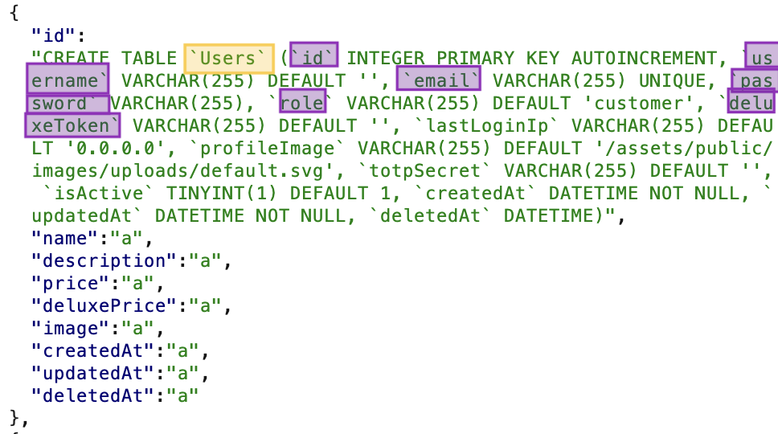
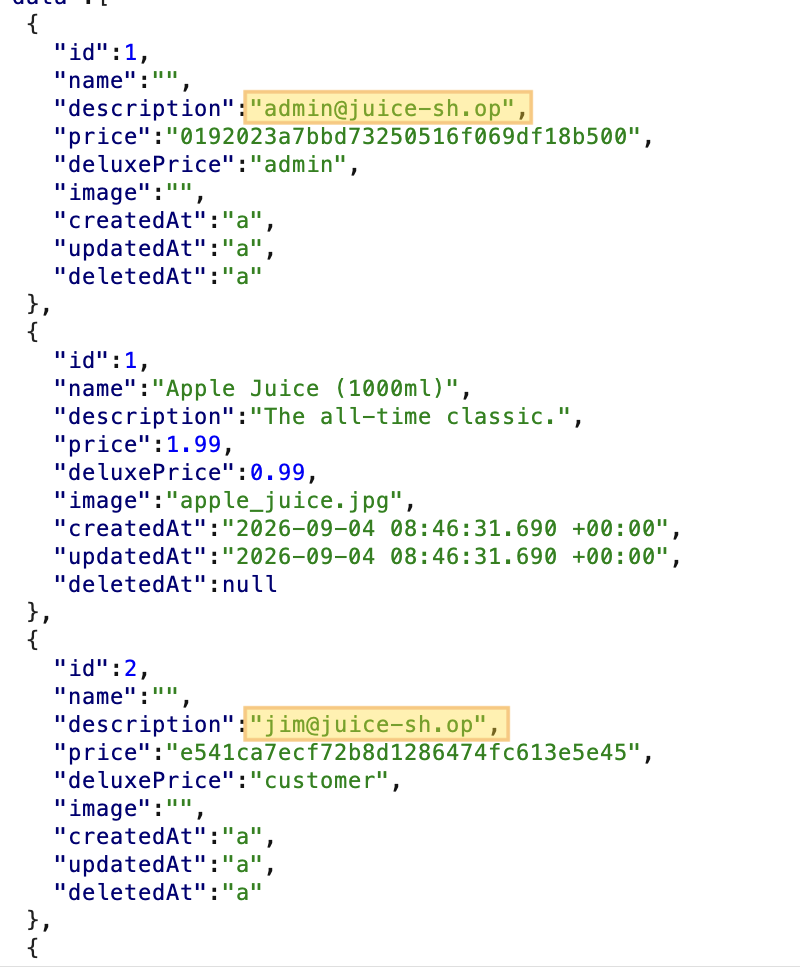
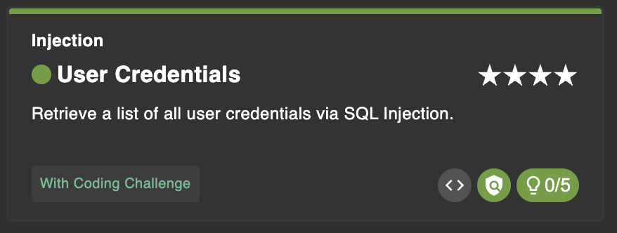
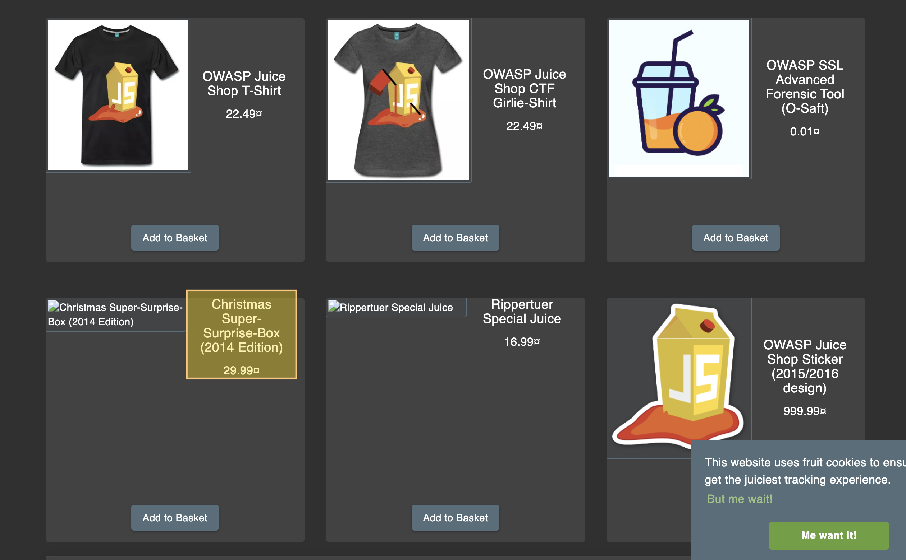
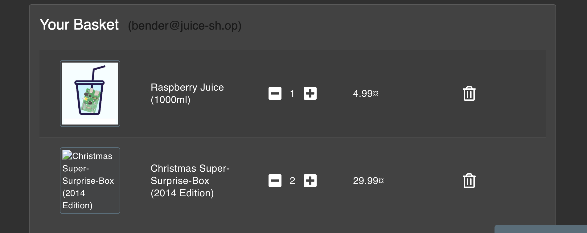
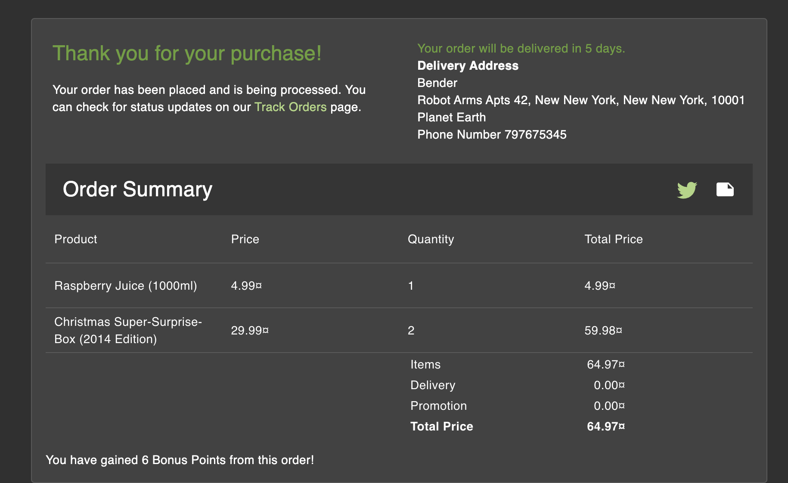
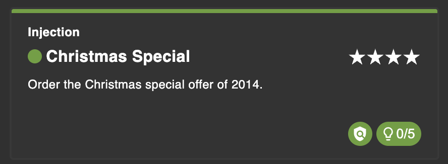

# SQL Injection (SQLI) - Extra Report 

In this report, the OWASP Juice Shop webapp is used to showcase an extra SQL Injection vulnerability. 

In particular: 

- [User Credentials](#1-user-credentials)
- [Christmas Special](#2-christmas-special) 

### Tools

- OWASP Juice Shop (running from Docker image) v19.0.0
- Burp Suite Community Edition v2026.7.3

## 1. User Credentials

Referring to the challenge `2.3. Exfiltrate the entire DB schema` performed in the report [05_SQLI](/05_SQLI/Report.md), regarding the extraction of the entire database schema; 

Starting from the results obtained, that is, the complete structure of the entire schema, we proceed to extract the users.

- So, referring to the previous laboratory, we start from the situation in which we managed to obtain the structure of the entire database, in particular we are interested in the structure of the `Users` table: 

    

- Open Burp as a proxy and the Juice Shop in the browser.

- In the previous laboratory, point `2.1. Find a request with SQL response` indicates the point where to inject the payload. 

- Exploiting this information, in this case the injection to be carried out is constructed on the basis of the structure of the `Users` table:

    ```sql
        GET /rest/products/search?q='))+UNION+SELECT+id,username,email,password,role,deluxeToken,'a','a','a'+FROM+Users--
    ```
    
    The character 'a' inserted serves to balance the number of columns expected by the original query.

- In this way we successfully performed a `UNION` with the complete `Users` table. We note that in the output we are returned the users and the respective password hashes. 

    

    We have therefore completed the challenge: 

    

## 2. Christmas Special

For this challenge, we need the results obtained in point `2.2. Modify the request to extract data` and point `1. Bypassing Authentication` of the report [05_SQLI](/05_SQLI/Report.md).

In particular, the first point `1. Bypassing Authentication` is used to access the account from which to place the order, and the second point `2.2. Modify the request to extract data` is used to view the complete catalog. 

- Log in as `bender`, thanks to the results obtained previously:
    - user: `bender@juice-sh.op'--`
    - pass: `.`

- Via Burp, as previously done, we inject the payload in the search field: 

    ```sql
        GET /rest/products/search?q='))--
    ```
    
- In this way the server response will show us the entire complete catalog of products.
    
- Search for the Christmas product: `Christmas Special` 

    

- Add the Christmas product to the cart:

    

- Proceed to checkout with the order:
    
    

- Once the order was completed, we also completed the challenge. 

    


        

        


