# Adversary-in-the-Middle (AITM) 

Fourth laboratory of the Cybersecurity Laboratory course. 

In this report, we will use Burp Suite to intercept and modify HTTPS traffic between a client and a server, in particular we will use it to execute SSLStrip on BURP Proxy on: 

- A website that [doesn't use Strict Transport Security (STS)](#1-without-strict-transport-security-sts) 
- A website that [uses Strict Transport Security](#2-with-strict-transport-security-sts)

### Tools

- Burp Suite Community Edition v2026.7.3

## Preliminary Steps - Configure Burp for SSLStrip

### Edit Proxy Listener
- Open Burp Suite and go to "Proxy" > "Proxy Settings". 
- Search the section "Proxy Listener" > Edit the only interface.
- Then go to "Request handling" and check the "Force use of TLS" option.

    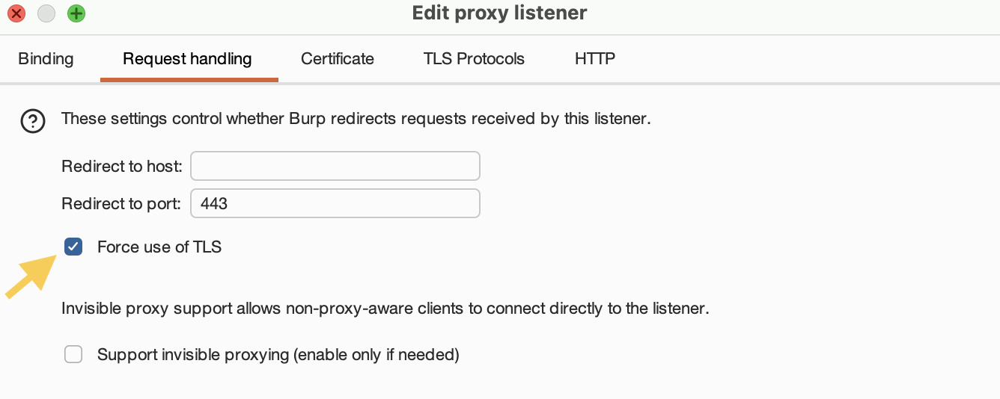

### Edit Response modification rules 
- Then "Proxy Settings"> Response modification rules 
- Check the following options:

    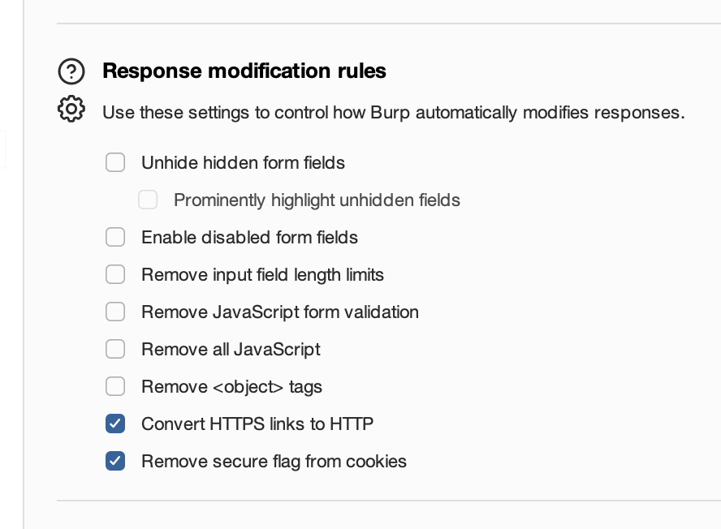

    These configuration steps are essential as they allow us to position ourselves in the middle (Adversary-in-the-Middle) between the client and the server, enabling the modification of server responses before they reach the client. 

    Specifically:
    - **Force use of TLS**: This forces Burp Suite to communicate securely via HTTPS with the remote server, even when handling unencrypted incoming requests from the client.
    - **Convert HTTPS link to HTTP**: This option replaces all internal references and links in the webpage from HTTPS to HTTP before they are delivered to the client in the server's response, forcing the victim's browser to communicate strictly over unencrypted HTTP.
    - **Remove secure flag from cookies**: This forces the browser to transmit session cookies over an unencrypted HTTP channel, exposing sensitive session tokens to the adversary.

## 1. Without Strict Transport Security (STS)

### 1.1 Choose the website 

- Using the `curl -I <URL>` command, we must identify a website that does not implement HSTS (HTTP Strict Transport Security), meaning it does not return the `Strict-Transport-Security` header in its HTTP responses.

- We test [www.uniroma1.it](https://www.uniroma1.it/it/):

    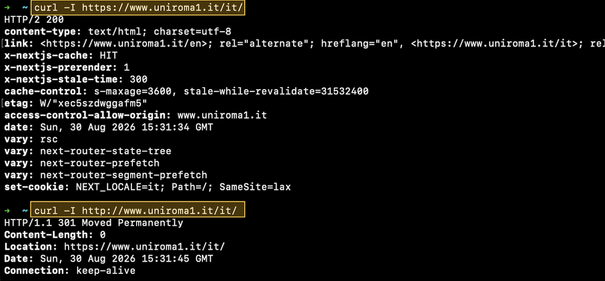

- We observe that the `Strict-Transport-Security` header is absent, making this site a viable target for the attack.

### 1.2 Open Website on Burp Browser

- We open Burp's built-in browser and navigate to `http://www.uniroma1.it/it/`, simulating the victim's request.

    

- As the adversary, we monitor Burp Suite to intercept, read, and alter the HTTP traffic exchanged between the victim and the server.

    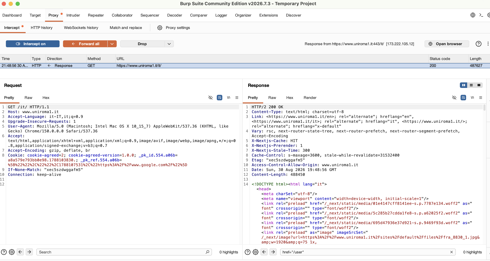

### 1.3 Modify the response using Match and Replace 

Using the **Match and Replace** section, we can define rules to modify HTTP responses before they are forwarded to the client.

1. First, we **disable JavaScript execution** by adding the following rule:

    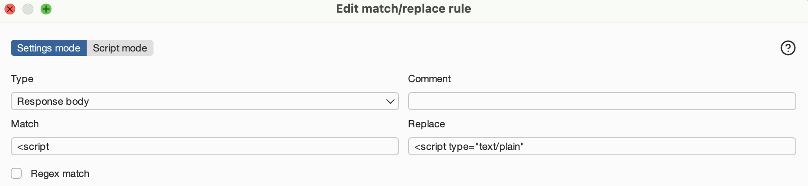
    
    By setting the rule type to "Response body" and replacing `<script` with `<script type="text/plain"`, the browser treats all script blocks as plain text and ignores them.
    
    This is necessary for this demonstration because the target website uses client-side JavaScript that dynamically sanitizes or restores the static HTML content, reverting our custom modifications to their original state.

2. We modify the login link to point to an external site (in this case, `https://portale.units.it`). This illustrates how an attacker can redirect users to a malicious phishing page to harvest credentials or other sensitive data.

    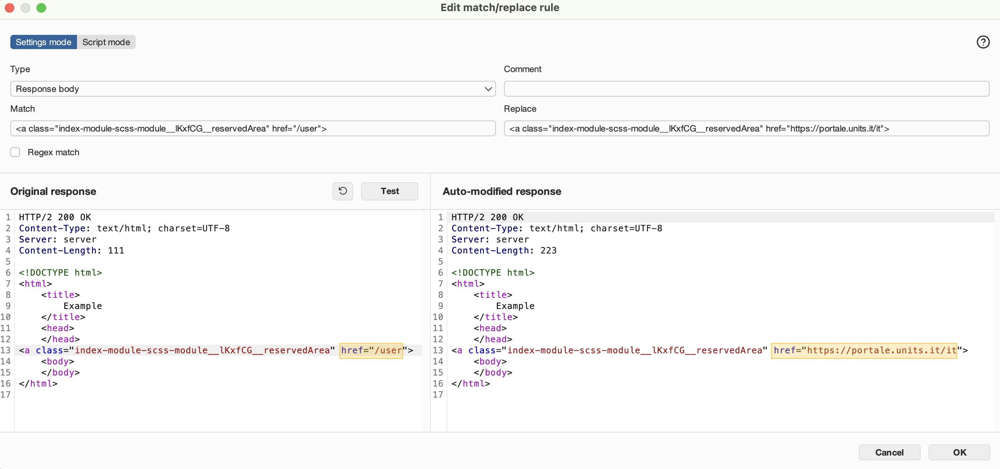
    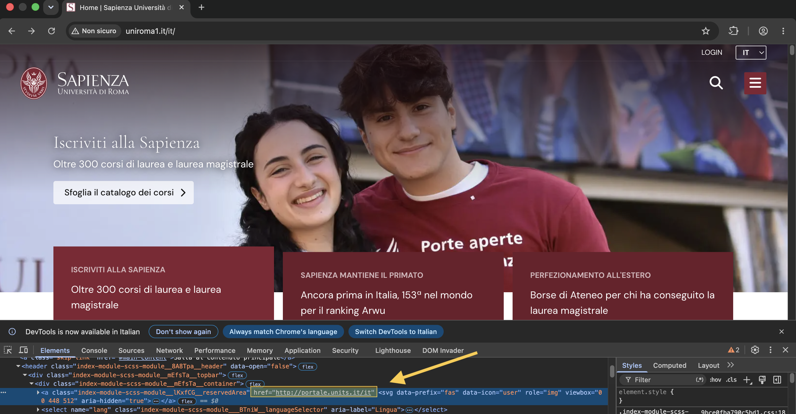
    

3. We modify the static text "Iscriviti alla Sapienza" to "Iscriviti a Torino" to demonstrate the ability to alter arbitrary static webpage content.

    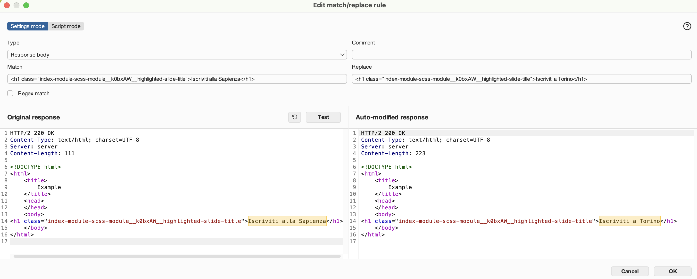
    

### Observations

These examples demonstrate that an attacker capable of executing an AITM attack can intercept, read, and manipulate all HTTP requests and responses. This allows them to alter the entire DOM structure of a webpage before it is rendered by the client. The security and privacy implications are severe: the adversary can extract sensitive credentials, hijack session cookies, and alter visible content. However, modern web standards implement security mechanisms, such as the HSTS header, to mitigate AITM and SSLStrip attacks.

## 2. With Strict Transport Security (STS)

### 2.1 Choose the website 

- Using the `curl -I <URL>` command, we select a website that implements HSTS and returns the `Strict-Transport-Security` header.

- We test [www.nytimes.com](https://www.nytimes.com):

    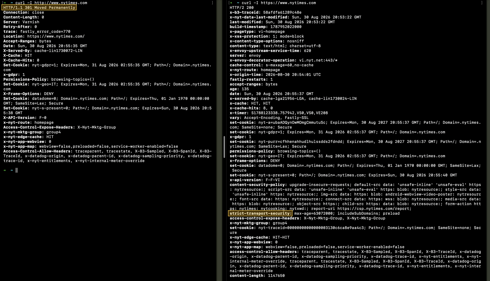

- We inspect the HSTS using `chrome://net-internals/#hsts` to confirm the policy is active for the domain:

    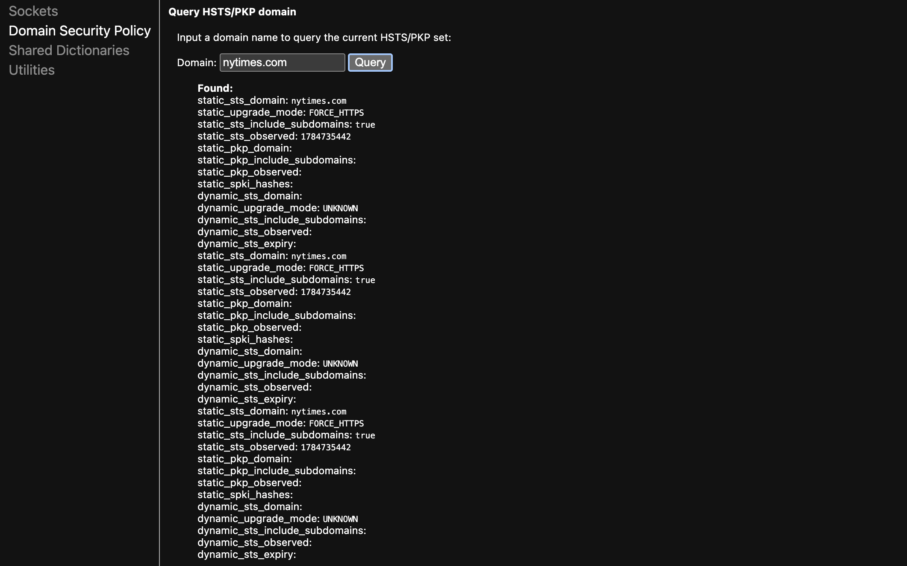

### 2.2 Open Website on Burp Browser

- We open Burp's browser and attempt to access the website via unencrypted HTTP (`http://www.nytimes.com`).

    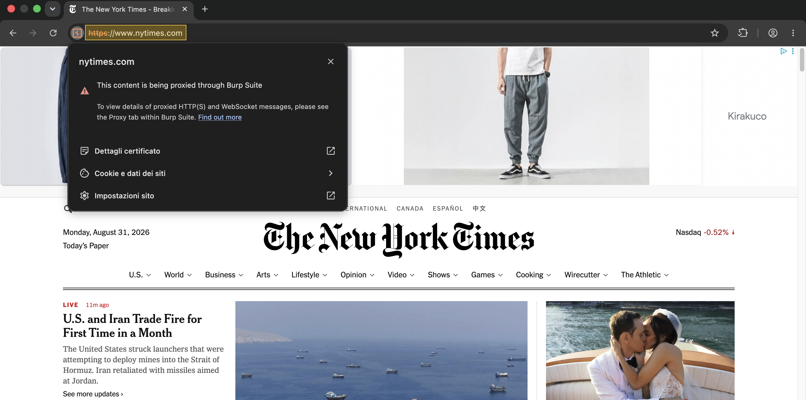

    We observe that the browser automatically upgrades the connection to HTTPS. As a result, Burp cannot downgrade the traffic, preventing a successful SSLStrip attack.

### 2.3 Simulating the "Before 1st Visit Window" (TOFU)

- If a user visits the website for the very first time, maybe the browser hasn't received the HSTS header yet, creating vulnerability window (Trust-On-First-Use or TOFU).

- To simulate this scenario, we attempt to delete the dynamic HSTS policy via `chrome://net-internals/#hsts`:

    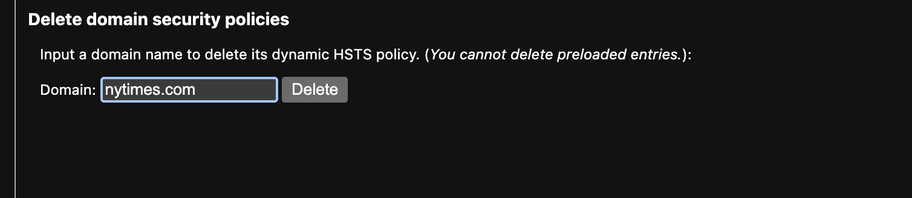

- We then query the domain again to check if the policy was successfully deleted:

    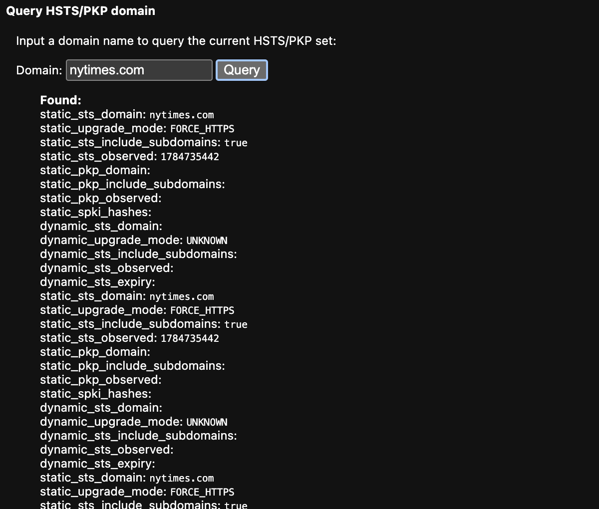

    Despite attempting to delete the entry, the policy remains active. This is because the domain is part of the **HSTS Preload List**, which is hardcoded directly into the Chromium source code. Consequently, the browser enforces HTTPS even during the very first connection.

### 2.4 Testing Domain Addition in Local HSTS Cache

- We add uniroma1.it to **local dynamic HSTS cache** via `chrome://net-internals/#hsts`

    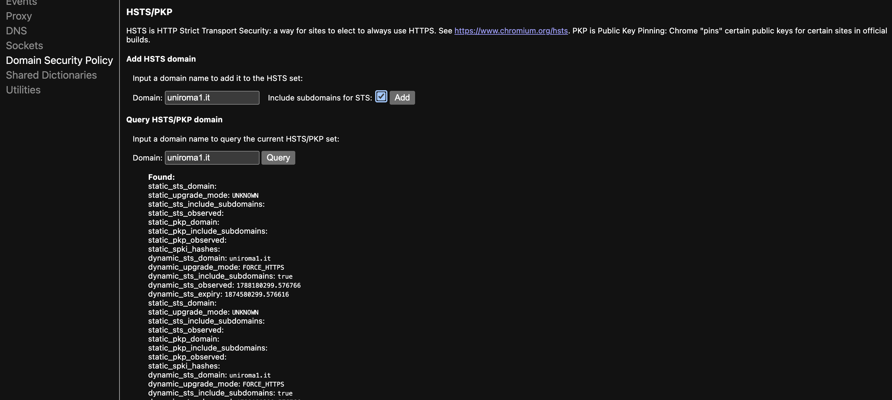

- Now we navigate to `http://www.uniroma1.it` via Burp's browser.

    

    As we can see, the browser immediately enforces HTTPS, neutralizing the SSLStrip attack.

***Observations***

- If a specific target domain was not yet included in the hardcoded HSTS Preload List of an older Chromium build, its policy would be stored only as a dynamic entry upon the first visit, making it possible to purge it via `chrome://net-internals/#hsts`. 

    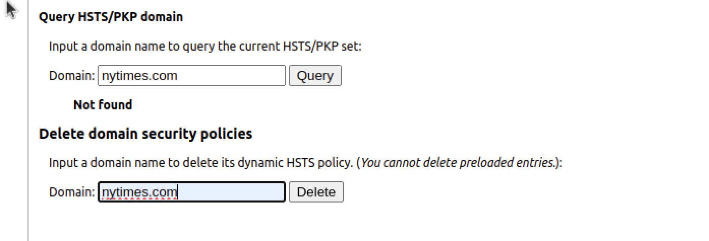

## Differences in Usage of Burp Proxy

- In a standard proxy configuration, Burp Suite acts as an intermediary between the ***client*** and the ***server***, establishing mutual trust on both sides using ***self-signed certificates***. This setup ensures ***secure HTTPS communication*** between the client and the proxy, as well as between the proxy and the server. In this scenario, the proxy decrypts the traffic to allow for analysis or modification.

- In an SSLStrip attack scenario, the configuration of the Burp proxy changes significantly. In this case, Burp acts as a ***protocol downgrade gateway***. The ***connection between the client and the proxy is downgraded to unencrypted HTTP***, while the ***connection from the proxy to the server is forced to use HTTPS***.

## Takeaways

- This lab demonstrates the inherent insecurity of the HTTP protocol and highlights the absolute necessity of HTTPS in ensuring data confidentiality and integrity.
- If a domain is included in the HSTS Preload List, SSL Stripping is completely neutralized, even if an attacker attempts to delete cached dynamic HSTS policies.
- However, security risks persist: if HSTS is not preloaded, an attacker can still execute an SSLStrip attack during the victim's first-ever visit to the website (the TOFU window).

